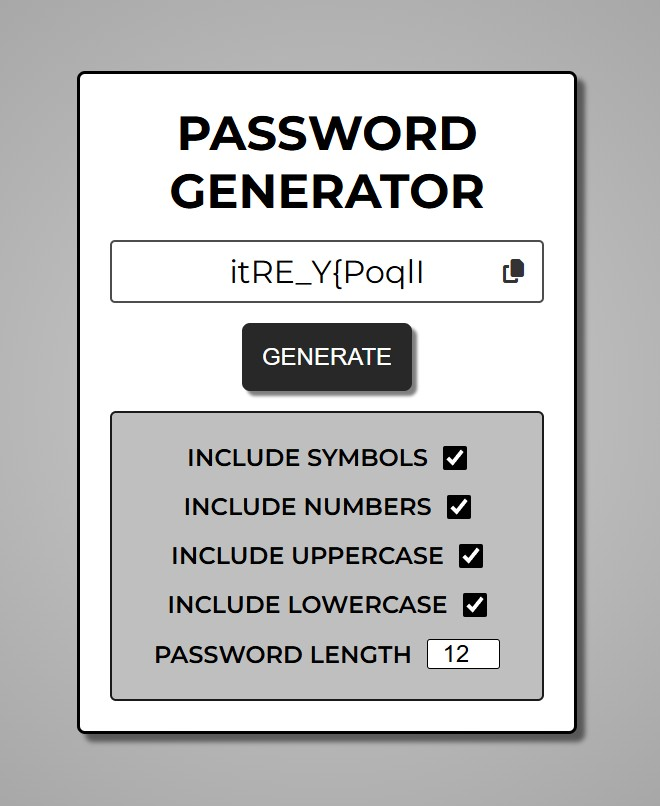

# Password Generator

## Project Summary

Password Generator is a fully responsive web application that allows users to generate strong, random passwords with customizable options such as length, uppercase and lowercase letters, numbers, and symbols. Built with HTML, CSS, and JavaScript, it features real-time generation, clipboard support, and a clean, mobile-friendly interface—perfect for enhancing digital security without relying on external libraries.

## Table of Contents

- [Mock-Up](#mock-up)
- [Instructions](#instructions)
- [Key Features](#key-features)
- [Deployed Application](#deployed-application)

## Mock-Up

The following image shows the web application's appearance and functionality:

## Instructions

To use this application, follow these simple steps:

- Download the project files or clone the repository.

- Open `index.html` in your web browser.

- Use the form controls to:

  - set your desired password length.

  - Choose whether to include symbols, numbers, and lowercase/uppercase letters.

  - Click the **Generate** button to create a new password.

  - Click the **Copy** button to copy the password to your clipboard.

## Key Features

**Responsive Design:** Mobile-friendly and fully responsive for use on any device.

**Clipboard Functionality:** Copy the password to your clipboard with a single click.

**Instant Generation:** One-click generation with immediate display of the new password.

**Error Handling:** Displays helpful messages if no options are selected or the length is invalid.

**Password Length Control:** Generate passwords of any length to suit your security preferences.

**Customizable Options:** Choose from numbers, symbols, lowercase letters, and uppercase letters to customize your password.

## Deployed Application

[Password Generator](https://gilmerperez.github.io/password-generator/)
